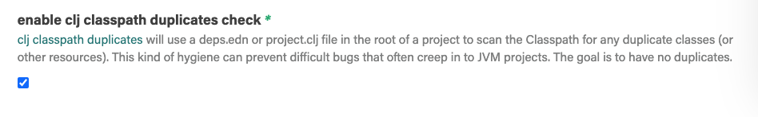
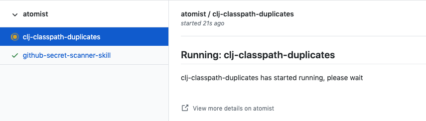

# `atomist/clj-checks-skill`

<!---atomist-skill-readme:start--->

# What it's useful for

Create GitHub Checks whenever a Push event occurs. Different checks can be enabled:

-   [clj-classpath-duplicates (link to description)](https://sr.ht/~severeoverfl0w/clj-classpath-duplicates/)
    The clj-classpath-duplicates check will run a check on any project containing a deps.edn or project.clj file.

# Before you get started

Connect and configure these integrations:

1. **GitHub**

The **GitHub** integration must be configured in order to use this skill.

# How to configure

1.  **Enable a Check**

2.  **Choose some Repos**

This will only run checks on Repos that contain code where the check makes sense.  It's safe to enable this on all Repos.

## How to use Update Leiningen Dependencies

Each time you Push a change, this skill will activate the tool and use it to create GitHub checks:

To create feature requests or bug reports, create an [issue in the repository for this skill](https://github.com/atomist-skills/clj-checks-skill/issues). See the [code](https://github.com/atomist-skills/clj-checks-skill) for the skill.

<!---atomist-skill-readme:end--->

---

Created by [Atomist][atomist].
Need Help? [Join our Slack workspace][slack].

[atomist]: https://atomist.com/ "Atomist - How Teams Deliver Software"
[slack]: https://join.atomist.com/ "Atomist Community Slack"
